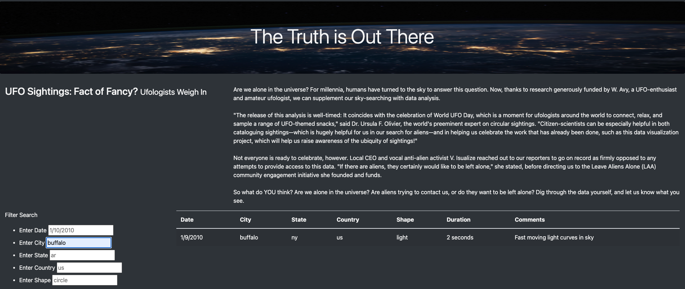

# UFOs :earth_americas:
[link to  deployed webpage](https://collaff2.github.io/UFOs/)

## :boom: Overview :boom:
    The purpose of this analysis is to provide a more in-depth look into the UFO sightings webpage by allowing the user to filter through multiple criteria at the same time. The user will be able to filter by date, city, state, country, and shape.
    This will be done by using html, bootstrap, css, and js.

## :boom: Results :boom:
    * After the new filters were applied we can link into the updated webpage with the link provided above.
    * Once on the new webpage you can locate the filter search on the lefthand side of the page.
   

   * The  user can now search on different criteria. They can choose date, city, state, country, and or shape. Someone can choose only one filter or a combination of multiple or all filters.
   * Once the  search criteria is entered, the redults will pop up in the table to the right.
   
   